First Steps
===========

.. contents:: Table of Contents
   :depth: 1
   :local:

Install
+++++++

Currently there is no option to install the program implemented. Please have a look at the README.md file in the repository how to build the program.

Adding items
++++++++++++

On the left side of the program you can find different objects which can be added to the scene in the middle using Drag & Drop. 

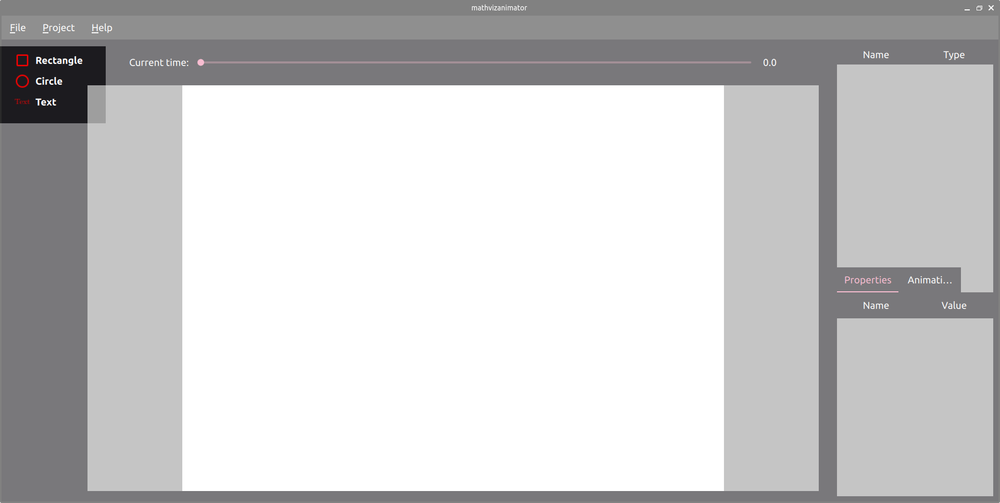

In this example a rectangle is selected by holding the left mouse button and dragging it to the scene in the middle of the application.

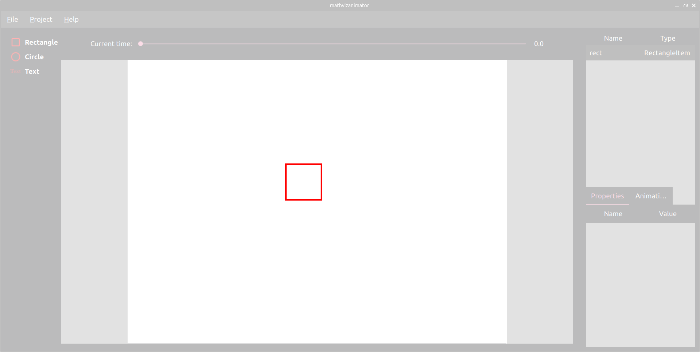

Adding an animation
+++++++++++++++++++

Right clicking on the item opens a menu, where you can choose the option "Add animation".

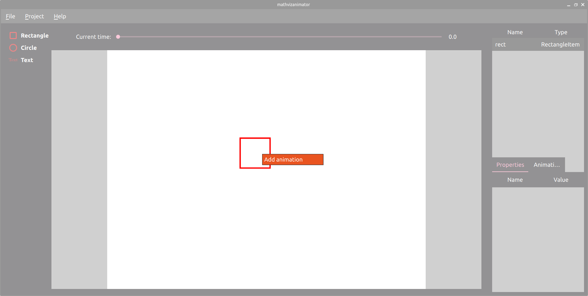

A popup will be shown where the type of the animation as well as the starting time and duration can be chosen. In this example, a "FadeIn" animation will be
used starting after one second and with a duration of two seconds.

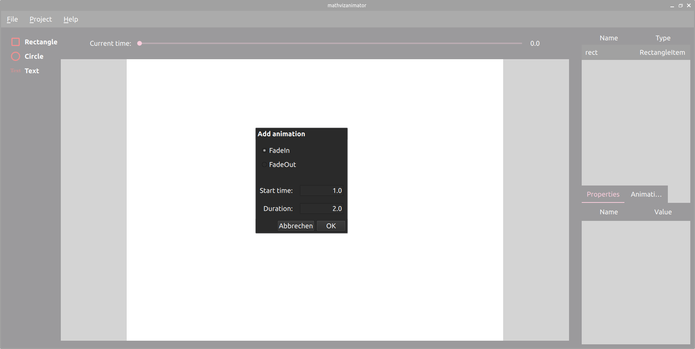

.. note:: A fade in animation changes the opacity of an object from 0.0 to 1.0. The default opacity value of an object is 1.0. If you add a FadeIn animation, the opacity will drop from 1.0 to 0.0 at the start time of the animation. To ensure that object is not visible at the start in the rendered video, the opacity property needs to be set to 0.0. Below in this tutorial you can see how to do that.

Also a "FadeOut" animation will be added using the same process. Starting at four seconds with a duration of one second.

You can inspect the added animations by clicking on the item, either directly or using the list on the top right side. After that you have to choose the animations tab on bottom right of the 

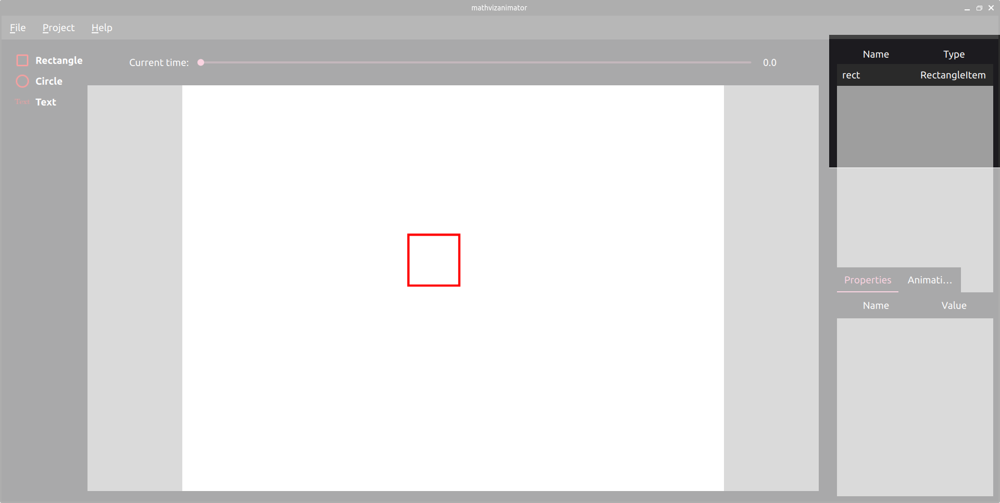
  
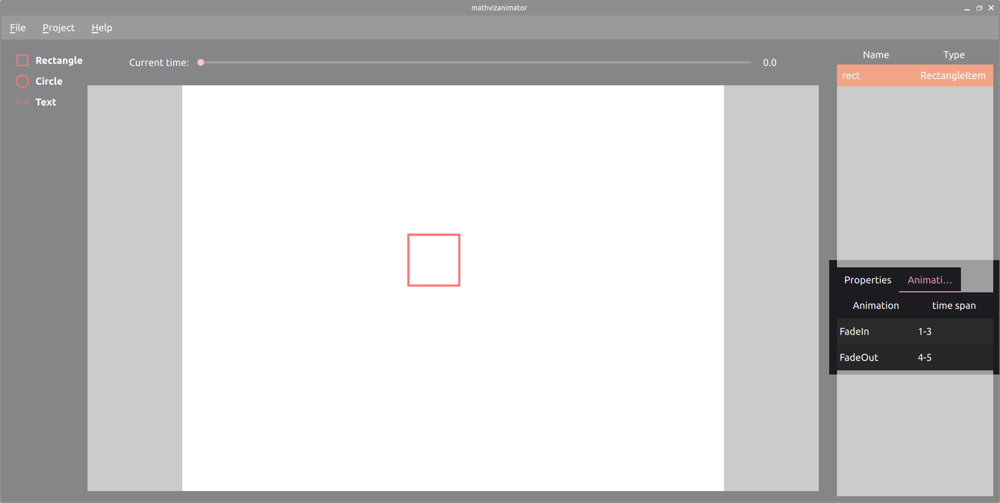

.. note:: Currently there is no option to modify existing animations. If you want to change an animation you have to delete the animation by right clicking on it and chose "Delete animation", see image below. After that you can add a new animation as described above.

Change a property
+++++++++++++++++

It is important to understand that the values of the properties of an object, which you can change in the UI, are the values at the start of the video at zero seconds. If you want to change properties after that, animations should be used. To check the current properties of an object, you have to select it either by clicking on it or selecting it in the list in the top right corner. The properties will be shown on the bottom left, when the Properties Tab is active.

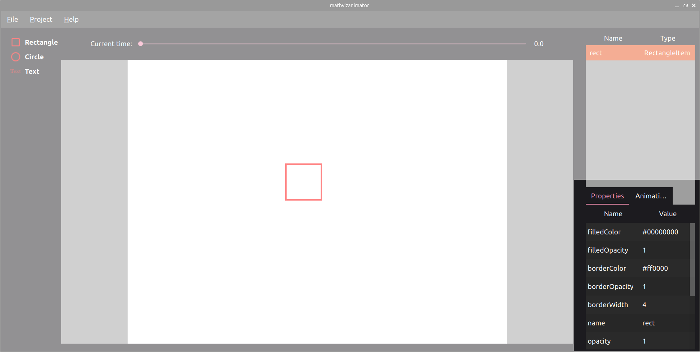

You may notice, that there are different opacity values: **filledOpacity**, **borderOpacity** and **opacity**. **filledOpacity** changes the opacity of the color which filles the object. **borderOpacity** represents the opacity of the border of the object. The general **opacity** property affects the whole object and can be used for example for the fade in and out animation. The opacity of the border and the filled color are determined by multiplying the **opacity** property with **borderOpacity** and the **filledOpacity** respectively. So if you want to change the opacity of the whole object use the **opacity** property. If you want to have more flexibility, use the **borderOpacity** and **filledOpacity** property.

In this example the **filledOpacity** property is set to 0.4 and the **filledColor** property to *blue*. Note that the default color values are shown as hexadecimal number (#00000000 is transparent), but you can also use color names like *red* or *green*. Also the rectangle is rotated by 55 degrees by changing the rotation property to 55. The size of the rectangle can be changed using the **width** and **height** property. In this example we set it to *width=250* and *height=350*. While you can hold the left mouse button and move the rectangle wherever you want, the position of the object can also be changed by modifying the **x** and **y** property of the object. The origin of the coordinate system is located at the top left corner and the y-axis goes down. In this example *x=400* and *y=200* is used.

.. note:: The values for the **x** and **y** property are in pixels. So you can work pixel perfect if you want to. How to change the resolution of the project will be shown in section :ref:`Change project settings`.

The width of the border can be changed using the property **borderWidth**. Here it is set to 10, so that we have a big visible border of the rectangle. The color of the border can be changed by changing the property **borderColor**, but let's keep it in *red* in this example. The only property left is now the **name** property of the object, which is also shown in the top right object list. It has no direct effect on the appearance of the object, but keep the warning below in mind.

.. warning:: The name property is used internally to distinguish between the objects. So it is not allows to have multiple objects sharing the same name!

After changing all this properties lets have a look at our rectangle:

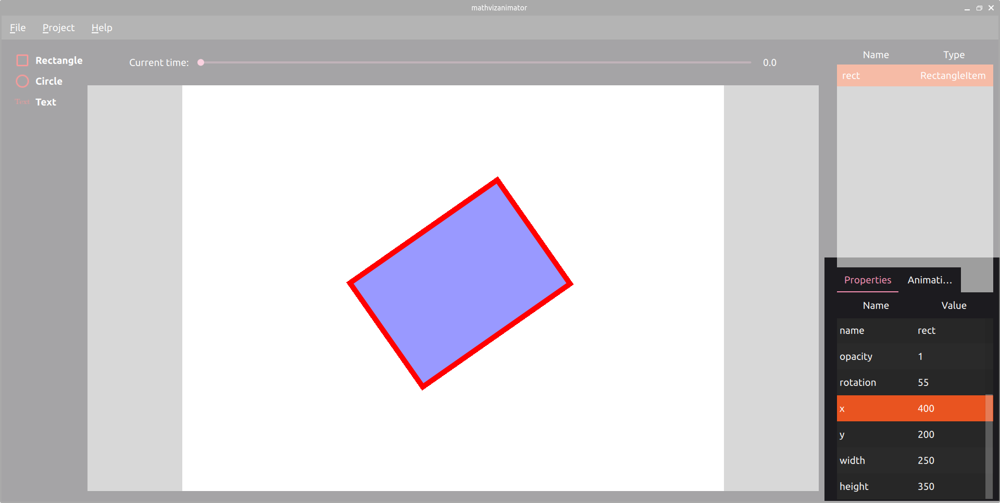

There is one thing left to do. Changing the **opacity** to 0.0. Since we use the fade in animation (see section :ref:`Adding an animation`) the rectangle would be visible at the beginning and just disappear at one second if we don't change this property. After doing so you will see that the rectangle disappears on the screen. This is because the current project time is set to 0.0. How to change that is described in the next section.

Change current project time
+++++++++++++++++++++++++++

The current project time is visible at the top of the application.

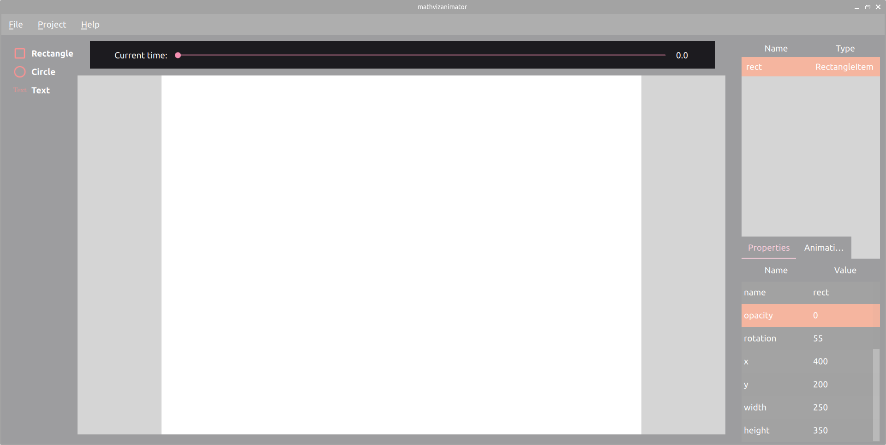

Changing the project time will update all objects to the time set by the user. This means all animations are applied to this time. For example at 2.2 seconds, the rectangle is somehow in the middle of the FadeIn animation.

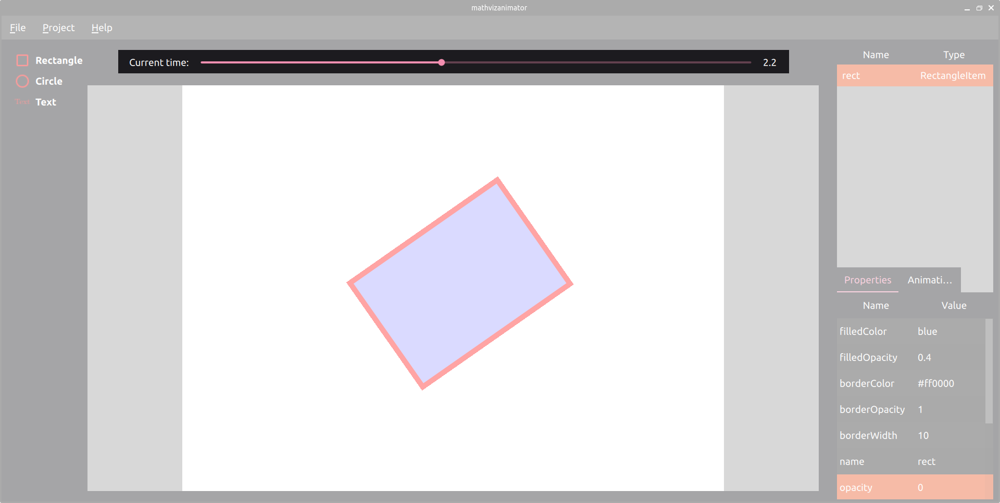

Change project settings
+++++++++++++++++++++++

Under the menu item **Project->Project Settings** the settings of the project can be opened and modified.

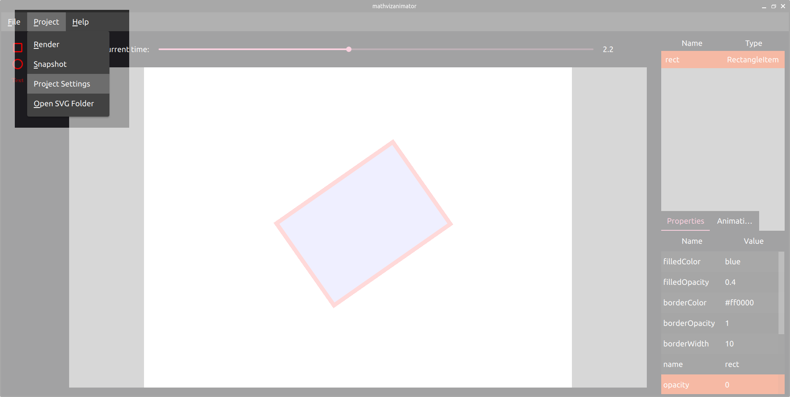

In this example the **video length** is changed to seven seconds. In this menu also the **width** and **height** of the rendered video as well as the **frames per second (fps)** can be modified.

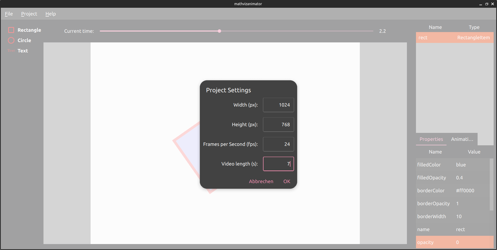

Also the background color can be changed here by clicking on the rectangle and choosing a color. This is not visible in the screenshot above.

Create a snapshot
+++++++++++++++++

It is possible to create a snapshot of the currently shown image of the application. It means you can choose any project time of your video and create snapshots from it. They will be saved in the *.png* format per default. Other formats may work too, but they are not officially supported. Click on **Project->Snapshot** and choose file name and destination.

Here is the resulting snapshot for the current time of 2.2 seconds. Note that the black border is added afterwards to create a contrast to the white background. It is not part of the created snapshot.

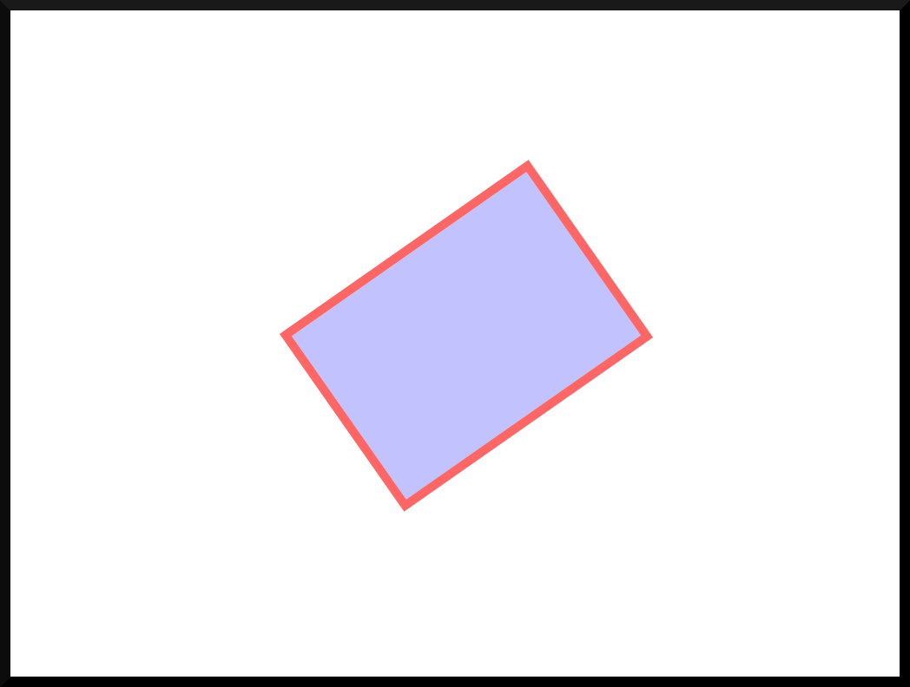

Render the video
++++++++++++++++

The animated video can be rendered by clicking on **Project->Render** and choose file name and destination. The video will be saved as *.mp4* file as default. Note that ffmpeg supports other formats like *.mov*, which can be set manually by the user. Currently there is no check or anything so if you use another extension than *.mp4* it is not guaranteed that the rendering process works. The save file is stored in json-format. So you can open and inspect it with any text editor if you like.

.. note:: Note that there is currently no progress indicator or something similar to show the progress of the rendering process. If you can observe the logging output of the program, for example in your IDE, you can see the output from ffmpeg there and how it's progressing. 

Save the project
++++++++++++++++

The project can be saved by clicking on **File->Save As** and choose file name and destination. There is currently no option to save via shortcut or directly to the same file. You have to overwrite by following the process as explained before.

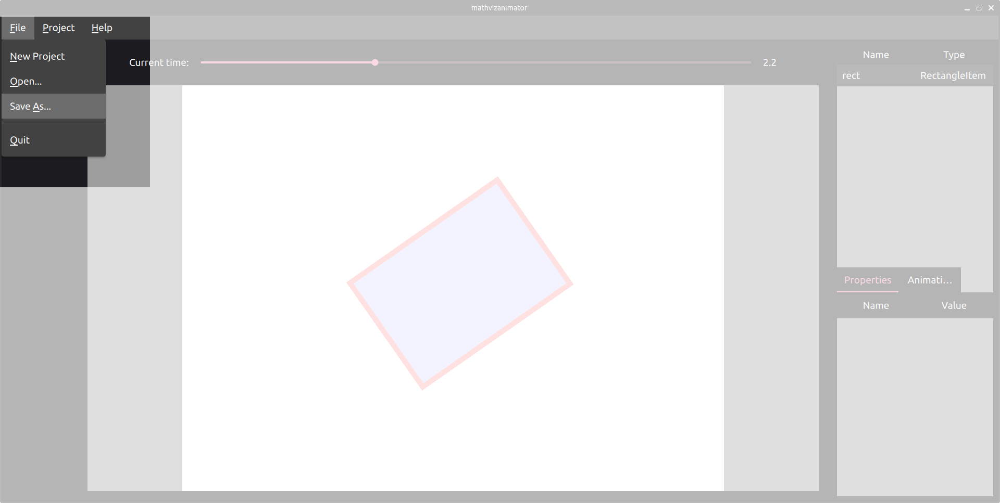

.. note:: The files (save file, video and snapshot) of this example can be found in the examples/first_steps folder of the repository.