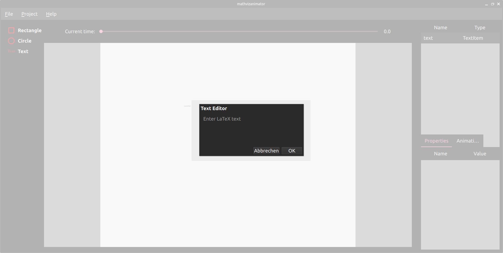
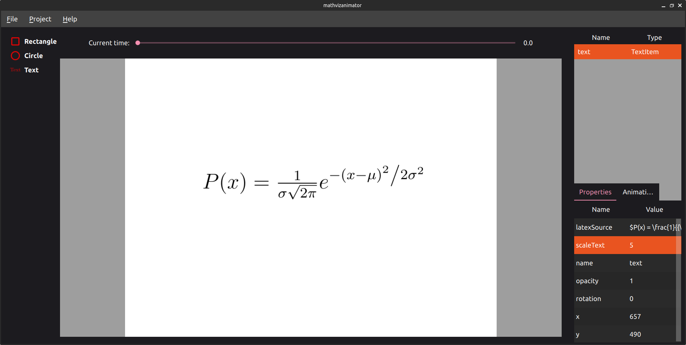
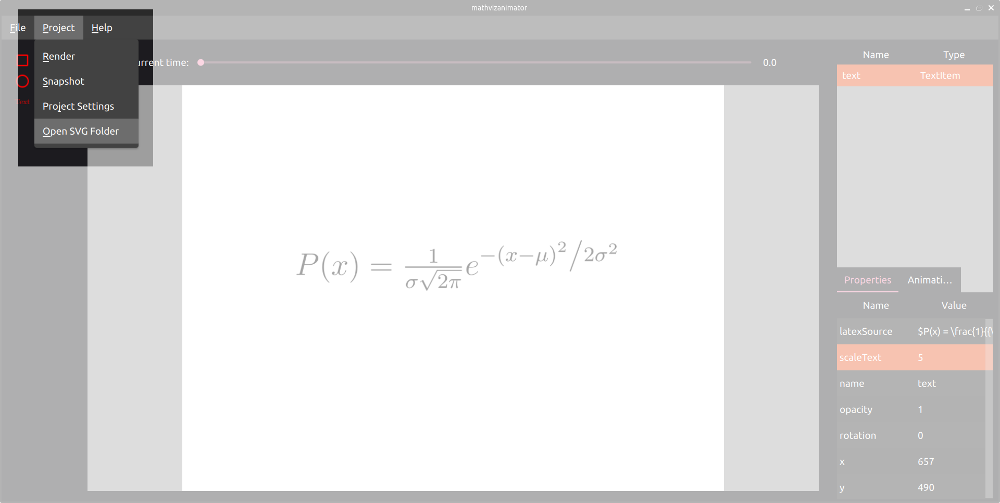

Text Object
===========

The text object is bit different to the other objects which are currently available. When adding a text object to the project, a popup will open where you can add your text. `LaTeX <https://www.latex-project.org/>`_ is used to interpret and create a Svg representation of your text and add it to the project. 

All the surrounding commands are added for you in the background. So you can write just normal text here like "Hello World" and everything else will be done for you. But you can also write equations like this:

.. code-block:: latex

    $P(x) = \frac{1}{{\sigma \sqrt {2\pi } }}e^{{{ - \left( {x - \mu } \right)^2 } \mathord{\left/ {\vphantom {{ - \left( {x - \mu } \right)^2 } {2\sigma ^2 }}} \right. \kern-\nulldelimiterspace} {2\sigma ^2 }}}$

Don't forget the "$" at start and end of the equation to write in math mode. After clicking "Ok" the Svg image will be created, which may take a short time. 

The Text object uses the original size of the text, which is normally quite small. Instead of a **width** and **height** property the text object has the property **scaleText** to change the size of the text. For example using **scaleText=5** the above equation looks like this:

You can change the LaTeX text later in the property **latexSource**. But you can only do that in the small space in the table on the bottom right. Currently the LaTeX Text Editor can't be opened again.

The created **.tex and .svg files** are stored in a local folder on your computer. If you want to use them outside of the MathVizAnimator application you can open this folder by clicking on **Project->Open SVG Folder**.

.. note:: Currently there is no property to change the color of the text. If you want colored text, you have to specify that in the LaTeX text.
