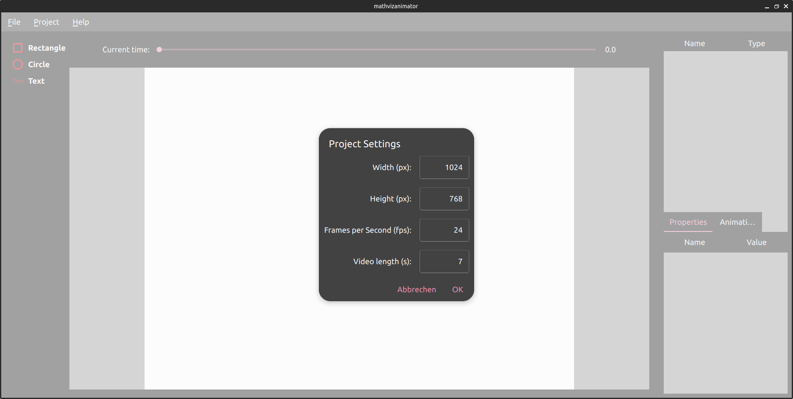

Project Settings
================

In :ref:`Change project settings` there was already explained how to open the project settings (**Project->Project Settings**) and how to change the length of the video. Here we take a closer look on all the options we have.

Height and Width
++++++++++++++++

In the project settings window the height and width (in pixels) of the rendered video can be changed. The part in the middle of the program where you create your 
video is scaled, s.t. it always fits on your screen. Then you change the size of your rendered video, the program tries to scale your objects such that they will stay in the same spot and look like before. MathVizAnimator only supports integer values for this parameter.

.. warning:: It is recommended to set the size of the project at the start, before adding any items. Currently the scaling of the objects does not work perfectly.

Frames per second
+++++++++++++++++

You can specify the number of frames per second of the rendered video. Per default it is set to 24 frames per second. A higher number of frames increases the rendering time, since more Images have to be created for every second of the video. MathVizAnimator only supports integer values for this parameter.

Length of the video
+++++++++++++++++++

The length of the video is given in seconds. Per default it is set to 5 seconds, but it can be changed to any integer number. 
